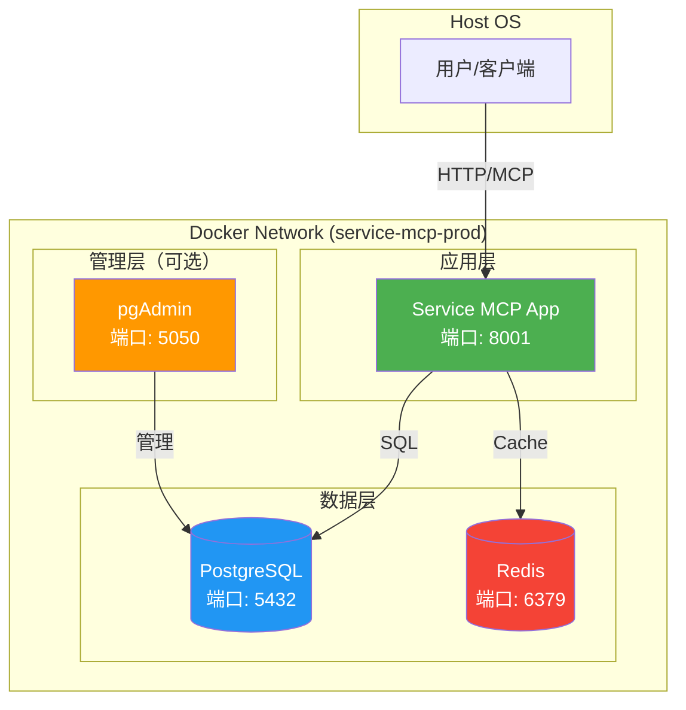
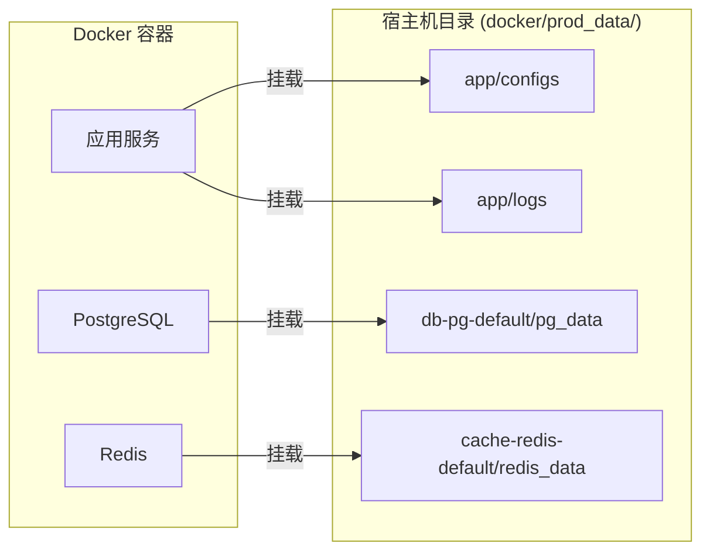
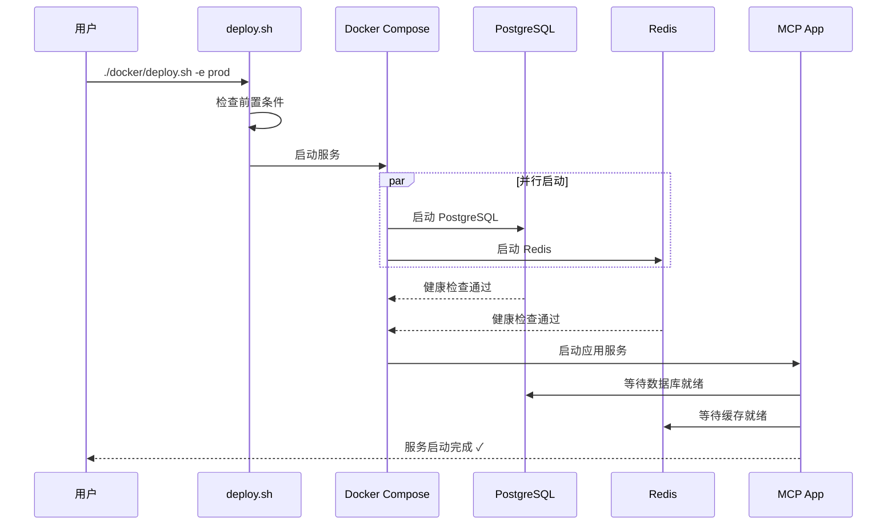

# Docker 部署指南

## 快速开始

### 1. 创建环境配置文件

```bash
cp docker/.env.example docker/.env
```

### 2. 修改配置

编辑 `docker/.env` 文件，修改数据库密码：

```bash
# 必须修改！
DB_PG_DEFAULT_PASSWORD=your_secure_password_here

# 可选：Redis 密码
# CACHE_REDIS_DEFAULT_PASSWORD=your_redis_password
```

### 3. 部署服务

```bash
# 使用管理脚本（推荐）
./docker/ctl.sh deploy -e prod

# 或直接使用 docker compose
docker compose -f docker/compose.yml up -d
```

### 4. 访问服务

- **MCP 服务**: http://localhost:8001/mcp
- **pgAdmin**（可选）: http://localhost:5050

## 配置文件说明

### compose 文件结构

| 文件                 | 用途           |
|--------------------|--------------|
| `compose.yml`      | 生产环境（包含所有服务） |
| `compose.dev.yml`  | 开发环境覆盖       |
| `compose.test.yml` | 测试环境覆盖       |

### 环境变量文件

| 文件             | 用途       |
|----------------|----------|
| `.env`         | 生产环境变量   |
| `.env.dev`     | 开发环境变量   |
| `.env.test`    | 测试环境变量   |
| `.env.example` | 生产环境变量示例 |

### 使用方式

```bash
# 生产环境
docker compose -f docker/compose.yml up -d

# 开发环境
docker compose -f docker/compose.yml -f docker/compose.dev.yml --env-file docker/.env.dev up -d

# 测试环境
docker compose -f docker/compose.yml -f docker/compose.test.yml --env-file docker/.env.test up -d
```

## 管理脚本用法

### ctl.sh / ctl.ps1 - 统一管理脚本

```bash
# Linux/macOS
./docker/ctl.sh <命令> [选项]

# Windows
.\docker\ctl.ps1 <命令> [选项]
```

#### 命令

| 命令       | 说明           |
|----------|--------------|
| `deploy` | 部署服务（首次部署）   |
| `start`  | 启动服务（已停止的服务） |
| `stop`   | 停止服务         |
| `update` | 更新服务（重新构建）   |
| `logs`   | 查看日志         |
| `test`   | 测试配置         |
| `help`   | 显示帮助信息       |

#### 选项

| 选项                   | 说明                                           |
|----------------------|----------------------------------------------|
| `-e, --env ENV`      | 环境类型: prod(生产), dev(开发), test(测试) [默认: prod] |
| `-p, --profile PROF` | 启用的 profile: admin(pgAdmin) [默认: 无]          |
| `-s, --service SVC`  | 查看特定服务的日志（仅 logs 命令）                         |
| `-b, --build`        | 强制重新构建镜像（仅 deploy/update 命令）                 |
| `-v, --volumes`      | 同时删除数据卷（仅 stop 命令）                           |

#### 示例

```bash
# 部署生产环境
./docker/ctl.sh deploy -e prod

# 部署开发环境 + pgAdmin
./docker/ctl.sh deploy -e dev -p admin

# 启动服务
./docker/ctl.sh start -e prod

# 停止服务
./docker/ctl.sh stop -e prod

# 停止服务并删除数据
./docker/ctl.sh stop -e prod -v

# 更新服务
./docker/ctl.sh update -e prod

# 强制重新构建并更新
./docker/ctl.sh update -e prod -b

# 查看所有日志
./docker/ctl.sh logs -e prod

# 查看应用日志
./docker/ctl.sh logs -e prod -s app

# 测试配置
./docker/ctl.sh test
```

-h, --help 显示帮助信息

```

### 示例

```bash
# 生产环境后台启动
./docker/ctl.sh deploy -e prod

# 开发环境前台启动
./docker/ctl.sh deploy -e dev

# 生产环境 + pgAdmin
./docker/ctl.sh deploy -e prod -p admin

# 强制重新构建镜像
./docker/ctl.sh update -e prod -b

# 停止服务
./docker/ctl.sh stop

# 查看日志
./docker/ctl.sh logs
```

## 部署模式

### 生产环境 (`-e prod`)

- PostgreSQL + Redis + 应用服务
- 使用 `docker/compose.yml`
- 数据持久化到 `docker/prod_data/`

### 开发环境 (`-e dev`)

- PostgreSQL + Redis + MySQL + InfluxDB + 应用服务
- 使用 `docker/compose.yml` + `docker/compose.override.yml`
- 数据持久化到 `docker/dev_data/`

### 测试环境 (`-e test`)

- 全部服务，使用偏移端口避免冲突
- 使用 `docker/compose.yml` + `docker/compose.test.yml`
- 数据持久化到 `docker/test_data/`

## 服务端口

| 服务         | 生产环境 | 开发环境 | 测试环境 |
|------------|----------|----------|----------|
| 应用         | 8001     | 8001     | 8001     |
| PostgreSQL | 5432     | 5432     | 5433     |
| Redis      | 6379     | 6379     | 6380     |
| MySQL      | -        | 3306     | 3307     |
| InfluxDB   | -        | 8086     | 8087     |
| pgAdmin    | 5050     | -        | -        |

## 常用命令

### 使用脚本（推荐）

**Windows 用户:**

```powershell
# 部署服务
.\docker\deploy.ps1 -e prod

# 启动服务
.\docker\start.ps1 -e prod

# 停止服务
.\docker\stop.ps1 -e prod

# 更新服务
.\docker\update.ps1 -e prod

# 查看日志
.\docker\logs.ps1 -e prod
```

**Linux/macOS 用户:**

```bash
# 部署服务
./docker/deploy.sh -e prod

# 启动服务
./docker/ctl.sh deploy -e prod

# 停止服务
./docker/stop.sh -e prod

# 更新服务
./docker/update.sh -e prod

# 查看日志
./docker/logs.sh -e prod
```

### 使用 docker compose 命令

```bash
# 查看服务状态
docker compose -f docker/compose.yml ps

# 查看日志
docker compose -f docker/compose.yml logs -f

# 查看特定服务日志
docker compose -f docker/compose.yml logs -f app

# 停止服务
docker compose -f docker/compose.yml down

# 停止并删除数据（危险！）
docker compose -f docker/compose.yml down -v
```

## 数据备份

### PostgreSQL

```bash
# 备份
docker exec service-mcp-postgres pg_dump -U postgres service_data > backup.sql

# 恢复
cat backup.sql | docker exec -i service-mcp-postgres psql -U postgres service_data
```

### Redis

```bash
# 触发备份
docker exec service-mcp-redis redis-cli BGSAVE

# 复制备份文件
docker cp service-mcp-redis:/data/dump.rdb ./redis_backup.rdb
```

## 测试配置

在部署之前，可以运行测试脚本验证配置：

```bash
# 测试 Docker 配置
./docker/test-docker.sh
```

## 故障排除

### 1. 端口被占用

修改 `docker/.env` 文件中的端口配置。

### 2. 数据库连接失败

```bash
# 检查数据库状态
docker compose -f docker/compose.yml ps db-pg-default

# 查看数据库日志
docker compose -f docker/compose.yml logs db-pg-default
```

### 3. 应用启动失败

```bash
# 查看应用日志
docker compose -f docker/compose.yml logs app

# 进入容器调试
docker exec -it service-mcp-app bash
```

### 4. Docker 构建失败

```bash
# 查看构建日志
docker compose -f docker/compose.yml build --no-cache

# 清理 Docker 缓存
docker system prune -a
```

## 架构说明

### 服务架构图



### 数据持久化



### 启动流程



## 安全建议

1. **修改默认密码**: 必须修改 `docker/.env` 中的数据库密码
2. **限制端口访问**: 生产环境中，仅暴露必要的端口
3. **启用 Redis 密码**: 取消注释并设置 `CACHE_REDIS_DEFAULT_PASSWORD`
4. **使用 HTTPS**: 配置反向代理（如 Nginx）启用 HTTPS
5. **定期备份**: 配置定期数据库备份策略

## 其他部署方式

### 本地部署（Windows/Linux/macOS）

如果你想在本地计算机上部署，请参考：

- **本地部署指南**: [LOCAL_DEPLOYMENT.md](./LOCAL_DEPLOYMENT.md)
- **Windows 用户指南**: [WINDOWS_GUIDE.md](./WINDOWS_GUIDE.md)

```powershell
# Windows
.\docker\ctl.ps1 deploy -e prod

# Linux/macOS
./docker/ctl.sh deploy -e prod
```

### 服务器部署（Ubuntu 24.04）

如果你想在 Ubuntu 服务器上部署，请参考以下资源：

1. **部署前测试**: 使用测试脚本在本地验证
2. **服务器部署指南**: 参考 [SERVER_DEPLOYMENT.md](./SERVER_DEPLOYMENT.md)
3. **系统要求检查**: 确保服务器满足硬件和软件要求

#### Windows 用户测试

```powershell
# 使用 PowerShell 测试脚本验证部署可行性
.\docker\test-ubuntu.ps1
```

#### Linux/macOS 用户

```bash
# 使用 Bash 测试脚本
chmod +x docker/test-ubuntu.sh
./docker/test-ubuntu.sh
```

## 快速参考

### 常用命令

**Windows 用户 (PowerShell):**

```powershell
# 部署服务
.\docker\ctl.ps1 deploy -e prod

# 启动服务
.\docker\ctl.ps1 start -e prod

# 停止服务
.\docker\ctl.ps1 stop -e prod

# 更新服务
.\docker\ctl.ps1 update -e prod

# 查看日志
.\docker\ctl.ps1 logs -e prod
```

**Linux/macOS 用户 (Bash):**

```bash
# 部署服务
./docker/ctl.sh deploy -e prod

# 启动服务
./docker/ctl.sh start -e prod

# 停止服务
./docker/ctl.sh stop -e prod

# 更新服务
./docker/ctl.sh update -e prod

# 查看日志
./docker/ctl.sh logs -e prod
```

### 文件说明

| 文件                             | 说明                        |
|--------------------------------|---------------------------|
| `Dockerfile`                   | 应用容器化配置                   |
| `docker/compose.yml`           | 生产环境 Compose 配置           |
| `docker/compose.dev.yml`       | 开发环境 Compose 配置           |
| `docker/compose.test.yml`      | 测试环境 Compose 配置           |
| `docker/ctl.sh`                | 统一管理脚本 (Linux/macOS)      |
| `docker/ctl.ps1`               | 统一管理脚本 (Windows)          |
| `docker/entrypoint.sh`         | 容器入口脚本                    |
| `docker/test-docker.sh`        | Docker 配置测试 (Linux/macOS) |
| `docker/test-ubuntu.sh`        | 服务器部署测试 (Linux/macOS)     |
| `docker/test-ubuntu.ps1`       | 服务器部署测试 (Windows)         |
| `docs/LOCAL_DEPLOYMENT.md`     | 本地部署指南                    |
| `docs/SERVER_DEPLOYMENT.md`    | 服务器部署指南                   |
| `docs/DOCKER.md`               | Docker 部署指南               |
| `docs/DEPLOYMENT_CHECKLIST.md` | 部署检查清单                    |
| `docs/WINDOWS_GUIDE.md`        | Windows 用户指南              |
